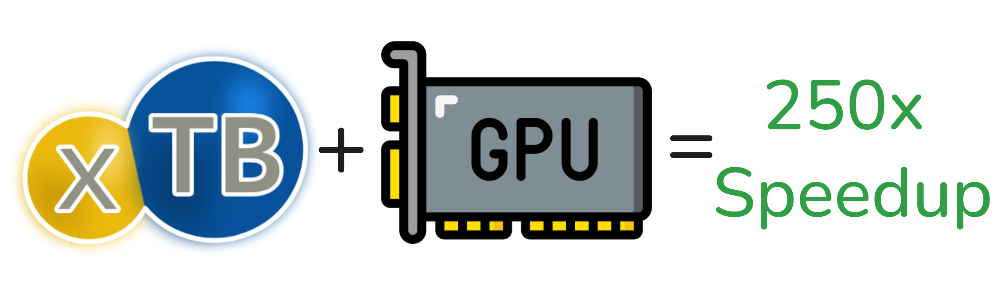
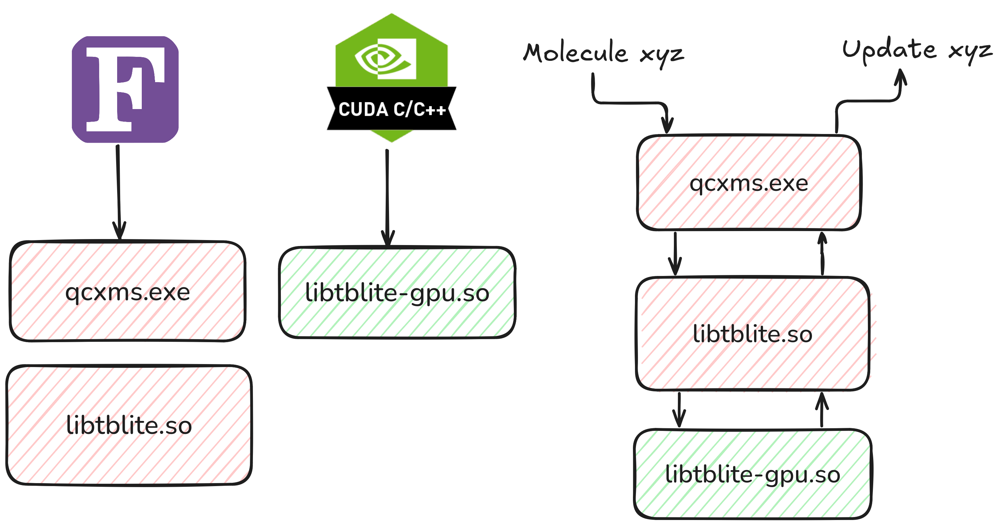
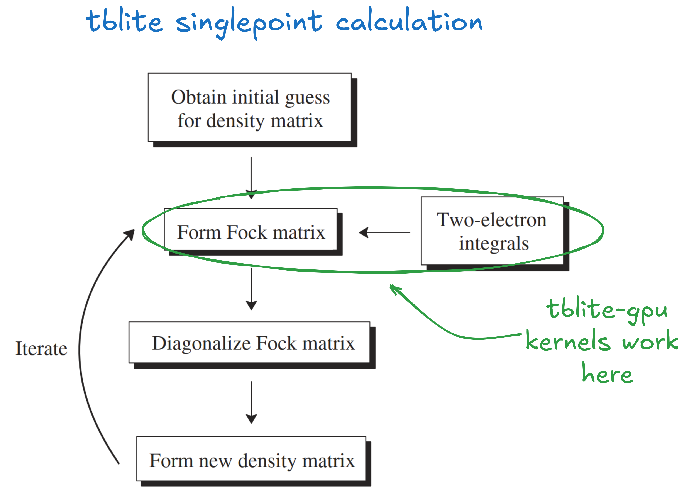
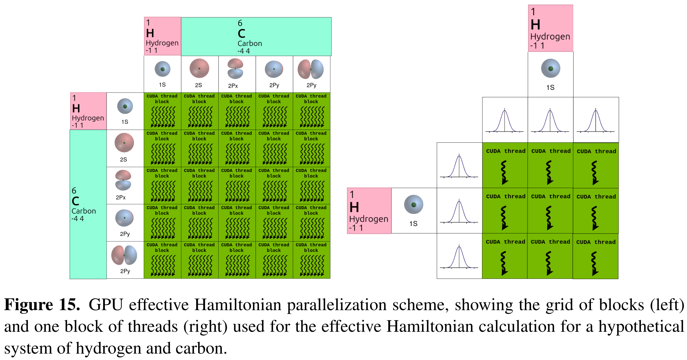
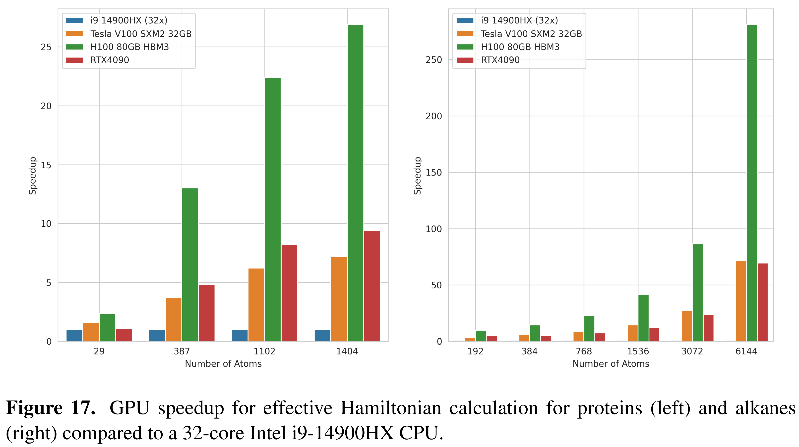

# GPU Extensions for tblite

[](https://github.com/tornikeo/tblite-gpu/blob/HEAD/COPYING.LESSER)

This project is an effort to use GPUs to accelerate [Light-weight tight-binding framework](https://github.com/tblite/tblite) (tblite) calculations.



## Overview

Currently, *tblite-gpu* contains two GPU kernels for fast Fock matrix integral calculations. Concretely, this is what happens when you compile and use *tblite-gpu*:



The bulk of the complex Fock matrix logic happens in *tblite*, while the computationally demanding parts are offloaded to a GPU by using the GPU library `libtblite-gpu.so`. Anything that uses tblite (*[QCxMS](https://github.com/qcxms/QCxMS)*, *[QCxMS2](https://github.com/grimme-lab/QCxMS2)*, etc.) can also use *tblite-gpu*.

Both kernels are defined inside the [src/main.cu](./src/main.cu) file. These kernels are used for building the Fock matrix:



Calculation of the Fock matrix is done in parallel because GPUs excel at parallelism. Here is how the parallelism works in these kernels:



All atomic orbitals are calculated using a CUDA thread block, and each thread in the block integrates a pair of primitive Gaussians.

The result is the following speedups for Fock matrix calculations:



A single H100 GPU shows up to a 250x speedup over a 32-core CPU node.

## Installation

### Building from Source

You need an NVIDIA GPU with compute capability >= 6.0, and the NVIDIA CUDA C compiler (`nvcc`):

```sh
$ nvcc --version
nvcc: NVIDIA (R) Cuda compiler driver
Copyright (c) 2005-2024 NVIDIA Corporation
Built on Thu_Mar_28_02:18:24_PDT_2024
Cuda compilation tools, release 12.4, V12.4.131
Build cuda_12.4.r12.4/compiler.34097967_0
```

To build tblite-gpu from source, you need to build and install [tblite (fork)](https://github.com/tornikeo/tblite) from source first.

# License

This project is free software: you can redistribute it and/or modify it under the terms of the Lesser GNU General Public License as published by the Free Software Foundation, either version 3 of the License, or (at your option) any later version.

This project is distributed in the hope that it will be useful, but without any warranty; without even the implied warranty of merchantability or fitness for a particular purpose. See the Lesser GNU General Public License for more details.

Unless you explicitly state otherwise, any contribution intentionally submitted for inclusion in this project by you, as defined in the Lesser GNU General Public License, shall be licensed as above, without any additional terms or conditions.